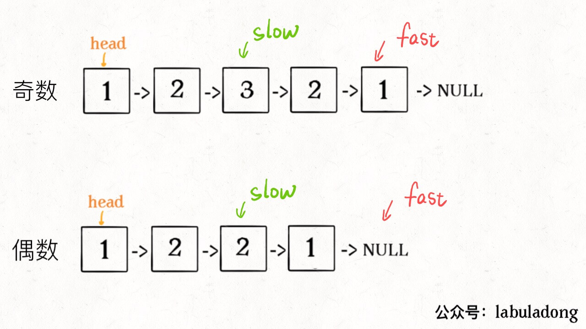

# Linked List

### Reverse Linked List 

```text
public ListNode reverse(ListNode head){
    ListNode pre = null, cur = head, nxt = null;
    while (cur != null) {
        nxt = cur.next;
        cur.next = pre;
        pre = cur;
        cur = nxt;
    }
    return pre;
}
```

### Fast and slow pointers 

1. find the middle node of linked list

```text
ListNode slow = head, fast = head;
while (fast != null && fast.next != null) {
    slow = slow.next;
    fast = fast.next.next;
}
```

If `fast == null`, then the length of list is even.

If `fast != null && fast.next == null`, the length is odd. 




